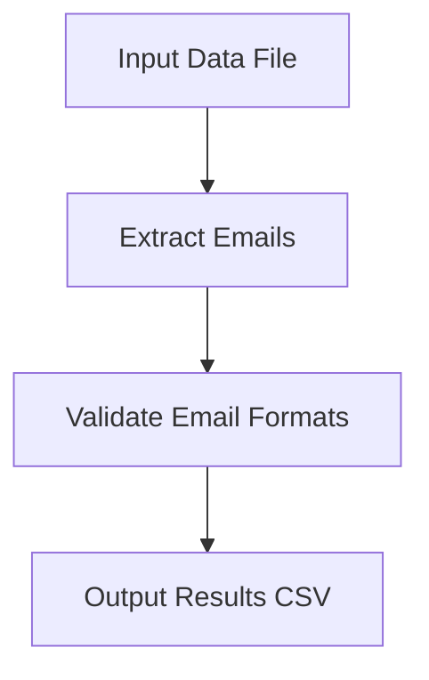

# Email Detection

## Introduction

Email Detection is a project aimed at identifying and validating email addresses from text or data sources. This repository provides tools and scripts for detecting, extracting, and verifying email addresses using various programming techniques and libraries. The project is useful for data cleaning, validation, and automation tasks where email address integrity is crucial.

## Features

- Accurate detection of email addresses using regular expressions.
- Validation of email formats to ensure compliance with standard patterns.
- Extraction of emails from plain text, files, or data streams.
- Support for batch processing of multiple files or datasets.
- Easy integration with other data processing pipelines.
- User-friendly interface for both command-line and programmatic usage.

## Requirements

To use the Email Detection project, ensure you have the following:

- Python 3.6 or higher
- pip (Python package installer)

### Python Packages

- re (regular expressions, standard in Python)
- pandas (for file/data processing, if used)
- argparse (for command-line interfaces)
- Additional dependencies may be required; refer to the `requirements.txt` file if available.

## Installation

Follow these steps to set up the Email Detection project:

1. Clone the repository to your local system:
   ```bash
   git clone https://github.com/Sourav1000888/Email-Detection.git
   cd Email-Detection
   ```

2. (Optional) Create a virtual environment:
   ```bash
   python3 -m venv venv
   source venv/bin/activate  # On Windows: venv\Scripts\activate
   ```

3. Install the required dependencies:
   ```bash
   pip install -r requirements.txt
   ```

If a `requirements.txt` file is not present, manually install needed packages:
   ```bash
   pip install pandas
   ```

## Usage

You can use the Email Detection scripts in different ways depending on your needs.

### Command-Line Usage

To extract emails from a text file:
```bash
python email_detection.py --input input.txt --output emails.csv
```
- `--input`: Path to the file containing text data.
- `--output`: Path to save the extracted emails in CSV format.

### Batch Processing

To process multiple files in a directory:
```bash
python email_detection.py --input-dir ./data --output emails.csv
```
- `--input-dir`: Directory containing multiple text files.

### Programmatic Usage

You can also use the core functions in your Python scripts:

```python
from email_detection import extract_emails

text = "Contact us at support@example.com for assistance."
emails = extract_emails(text)
print(emails)  # Output: ['support@example.com']
```

### Email Validation

Validate the format of an email address:
```python
from email_detection import is_valid_email

result = is_valid_email("user@domain.com")
print(result)  # Output: True or False
```

## Architecture Overview

The project is structured to separate core logic from interface layers. Below is a simplified flowchart of the typical process:



- Input data is read from a file or text source.
- Emails are extracted using regular expressions.
- Each email is validated for correct format.
- Results are written to an output file.

---

## Result
   1. Training Accuracy : 99%
   2. Testing Accuracy : 97%
   3. Precision Accuracy : 96%


For detailed function descriptions, code examples, and customization options, refer to the source code and inline documentation within the repository.
