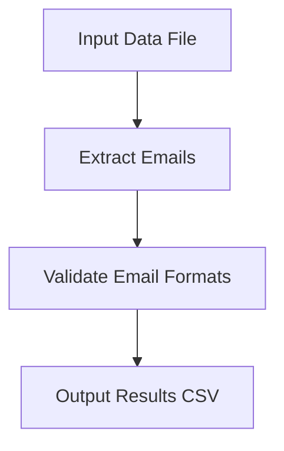

# Email Detection

## Introduction

Email Detection is a project aimed at identifying and validating email addresses from text or data sources. This repository provides tools and scripts for detecting, extracting, and verifying email addresses using various programming techniques and libraries. The project is useful for data cleaning, validation, and automation tasks where email address integrity is crucial.

## Features

- Accurate detection of email addresses using regular expressions.
- Validation of email formats to ensure compliance with standard patterns.
- Extraction of emails from plain text, files, or data streams.
- Support for batch processing of multiple files or datasets.
- Easy integration with other data processing pipelines.
- User-friendly interface for both command-line and programmatic usage.

## Requirements

To use the Email Detection project, ensure you have the following:

- Python 3.6 or higher
- pip (Python package installer)

## Architecture Overview

The project is structured to separate core logic from interface layers. Below is a simplified flowchart of the typical process:

```mermaid
flowchart TD
    A[Input Data File] --> B[Extract Emails]
    B --> C[Validate Email Formats]
    C --> D[Output Results CSV]
```

- Input data is read from a file or text source.
- Emails are extracted using regular expressions.
- Each email is validated for correct format.
- Results are written to an output file.

---

## Result
   1. Training Accuracy : 99%
   2. Testing Accuracy : 97%
   3. Precision Accuracy : 96%

